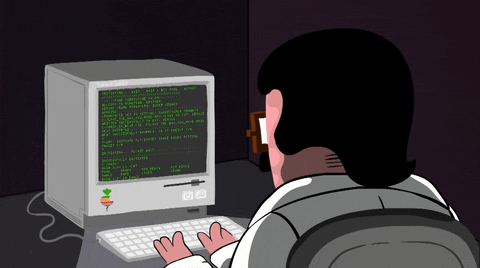

 

  こんにちは🙋‍♂️！<strong>Soumyadeep</strong> です。 

Full-stack web developer. Next.js-Prisma-PostgreSQL ~ exploring Go; Passionate about backend systems. Building Nesto ~ an ai powered Note and Snippet manager.

  

  

- 🔭 I’m currently working on [Nesto - A minimal app for saving notes and code snippets.](https://github.com/deepsoumya617/Nesto)

- 🌱 I’m currently learning `Next.js`, `TypeScript`, `Prisma`, `PostgreSQL`
- 🧠 I’m exploring Backend Development with **Go**

- 💬 Ask me about `C++`, `DSA`, `Next.js`, `React`, `TailwindCSS`, `TypeScript`

- 📫 How to reach me **soumyadeepghosh617@gmail.com**

<h3 align="left" style="font-family: sans-serif; letter-spacing: 0.8px">Connect with me:</h3>

<h3 align="left" style="font-family: sans-serif; letter-spacing: 0.8px">🛠️ Languages and Tools</h3>

<h4 align="left" style="margin-bottom: 6px; font-family: sans-serif; letter-spacing: 0.8px">💻 Languages</h4>

  

<h4 align="left" style="margin-bottom: 6px; font-family: sans-serif; letter-spacing: 0.8px">⚙️ Frameworks & Libraries</h4>

  

<h4 align="left" style="margin-bottom: 6px; font-family: sans-serif; letter-spacing: 0.8px">🗃️ Databases</h4>

  

<h4 align="left" style="margin-bottom: 6px; font-family: sans-serif; letter-spacing: 0.8px">🔧 Tools & Platforms</h4>

  

<h2 style="text-decoration: none; cursor: none; font-family: sans-serif; letter-spacing: 0.8px">📊 Github Stats:</h2>

<!-- 

 -->

<!-- Activity Graph -->

<h2 style="text-decoration: none; cursor: none; font-family: sans-serif; letter-spacing: 0.8px">📈 Github Graph:</h2>

<!-- leetcode stats -->

<h2 style="text-decoration: none; cursor: none; font-family: sans-serif; letter-spacing: 0.8px">🧪 Leetcode Stats:</h2>

<!-- top contributed repo -->

<h2 style="text-decoration: none; cursor: none; font-family: sans-serif; letter-spacing: 0.8px">⚒️ Top Contributed Repos:</h2>

<!-- spotify playlist -->

<h2 style="text-decoration: none; cursor: none; font-family: sans-serif; letter-spacing: 0.8px">🶠Last Listened To:</h2>

<!-- goodbye -->

  Thank you for visiting my profile!☺️ 
  Dont forget to star ⭐ the repos you like!

